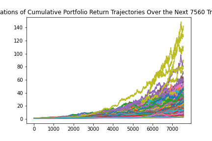
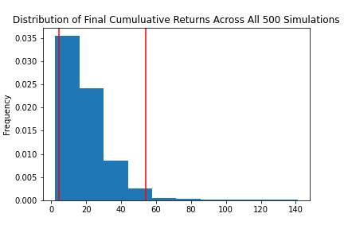
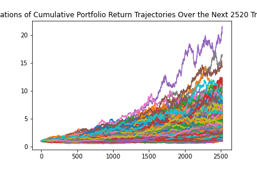
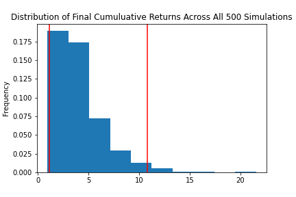

## 🐍🦙 APIs 🦙🐍
# [📈 Financial Planning 📈](financial-planner.ipynb)

## Savings Analysis

### Crypto Currency

The current value of your 1.2 BTC is $57013.20  
The current value of your 5.3 ETH is $19587.47  
The total value of your crypto portfolio is $76600.67  

### Stocks & Bonds

Current AGG closing price: $114.28\
Current SPY closing price: $416.53

The current value of your 200 AGG shares is $22856.00\
The current value of your 50 SPY shares is $20826.50\
The total value of your stocks is $43682.50

### Savings Health

You have a total of $120283.17 in savings\
64% of your savings is in crypto-currency\
36% of your savings is in stocks & bonds

Congratulations, you have more than 3 months income in your savings!

## Retirement Planning

### 30-yr Plan

 

#### Summary Data

mean:   19.816624\
std:    15.201269\
min:    2.208362\
25%:    9.610838\
50%:    16.211861\
75%:    25.812521\
max:    141.004942\
95% CI Lower:   4.592048\
95% CI Upper:   54.188342

There is a 95% chance that an initial investment of $20000 in the portfolio over the next 30 years will end within the range of $91840.97 and $1083766.84

There is a 95% chance that an initial investment of $30000.0 in the portfolio over the next 30 years will end within the range of $137761.45 and $1625650.25

### 5-yr Plan

#### Summary Data

mean              2.059960\
std               0.894847\
min               0.557543\
25%               1.420605\
50%               1.909766\
75%               2.514250\
max               8.906615\
95% CI Lower      0.836631\
95% CI Upper      4.151925

There is a 95% chance that an initial investment of $20000 in the portfolio over the next 5 years will end within the range of $16732.63 and $83038.5

### 10-yr Plan

#### Summary Data

mean              4.086263\
std               2.497756\
min               0.945046\
25%               2.287653\
50%               3.556031\
75%               5.081123\
max              21.532514\
95% CI Lower      1.165168\
95% CI Upper     10.782876

There is a 95% chance that an initial investment of $20000 in the portfolio over the next 10 years will end within the range of $23303.36 and $215657.52

### Find Initial Investment to achieve mean return of 30-yr plan

The mean return on $20000 invested for 30 years is $396332.49.\
In order to achieve the same mean investment in 10 years, you need to invest $97000.00.\
The amount increases to $193000 if you expect that mean return in only 5 years.

